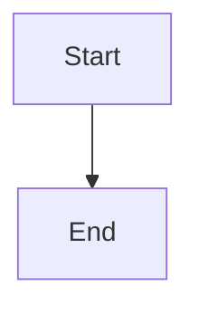

# Test Page

Some intro text with `inline_code`, **bold text**, and *italic text* mixed
together, plus a literal `star_*` inside a code span that must not be parsed
as emphasis.

- First bullet with `a_code_span` in it
- Second bullet continues
  onto a wrapped line

| Field | Description |
|---|---|
| `id` | The record id |
| name | Plain text value |

