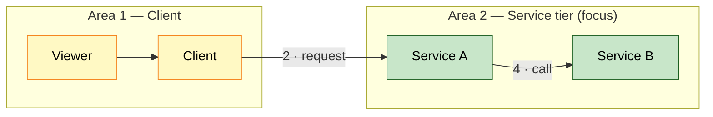
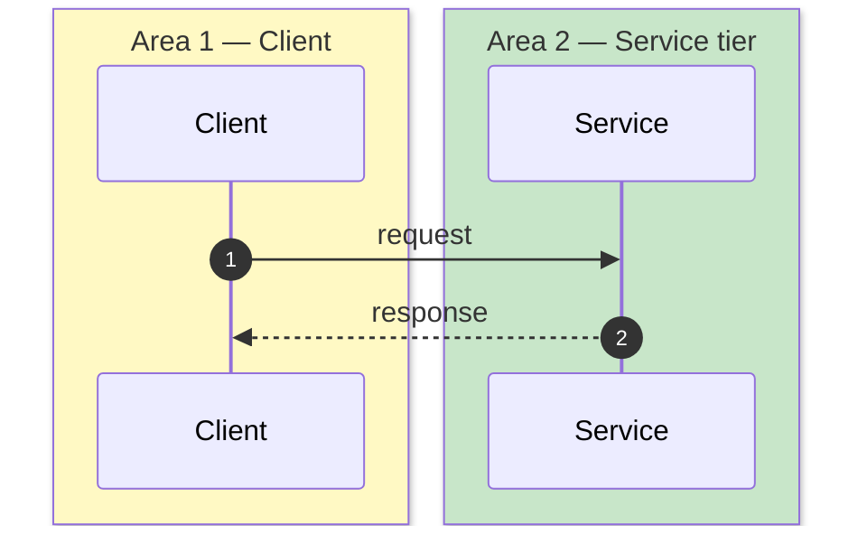
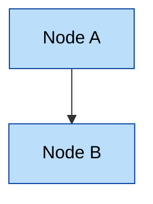
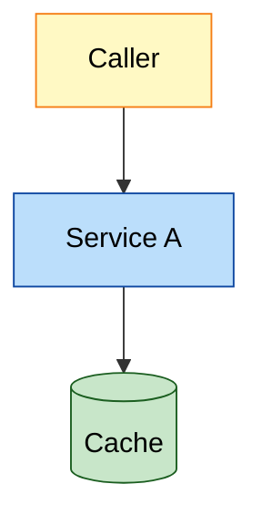

# Presentation & Diagrams

**Top priority of this skill.** A knowledge doc is only useful if it's *scannable* and its diagrams are *readable*. Optimize for a reader skimming in 60 seconds.

## Scannability rules
- **Bullets over prose.** Default to bullet lists. Avoid paragraphs longer than ~3 lines; break them up.
- **Comparisons → tables.** Any "X vs Y", option matrix, or before/after goes in a table, never inline prose.
- **Pros/cons & status → emoji.** Use a consistent legend:
  - 🟢 pro / good / strong / added · 🔴 con / bad / weak / removed · 🟡 caution / partial / aging
  - 🔵 changed · ⚪ unchanged · ⚠️ risk · ❌ blocker/missing · ✅ done/verified
- **One idea per bullet.** Lead with the noun/verb that matters; put detail in a sub-bullet.
- **Bold the keywords** a skimmer scans for (service names, values, verdicts).
- Keep each section short; if it grows, split it or push detail into an HTML collapsible.

## Diagrams — readability is mandatory
Diagrams are a primary deliverable, not decoration. Every diagram MUST pass `scripts/verify_mermaid.py --strict`.

### Rules
| Rule | Why | Verifier |
|---|---|---|
| **Vertical layout** (`graph TD` / `TB`) when many nodes | Horizontal (`LR`) sprawl becomes unreadable and tiny | warns on `LR` with > ~12 nodes |
| **Grouped/multi-area flows: top-level `graph LR` + each `subgraph` `direction TB`** (exception to vertical rule) | Lays areas out as a left→right pipeline with nodes stacked inside; avoids the tangled cross-area edges `graph TD` produces. Stays under the LR warning while ≤ ~12 nodes | see *Grouped flows* below |
| **Cap ~25 nodes** per diagram; split larger | Dense diagrams are illegible; split by concern | warns on > 25 nodes |
| **Always add color** + a legend — flowcharts via `classDef`; **sequence diagrams via `box rgb(r,g,b) … end`** | Color groups nodes and boosts comprehension fast | warns if no `classDef`/`style`/`fill:`/`box rgb(` |
| **Readable font** (HTML: set `themeVariables.fontSize`) | Default mermaid font shrinks on large graphs | warns on small/absent fontSize (HTML) |
| **Meaningful labels** + first-use acronym expansion | "Managed Instance Group (MIG)" not "MIG" | manual |
| **Number call order on edge labels** — in sequence *and* flowchart/component diagrams (e.g. `"6 · /ads per break"`); solid = call, dotted = response/async | Makes a component diagram readable as a sequence; lets the two diagrams cross-reference by step number | manual |
| **Collapse replicas** to one box | Reduces node count without losing meaning | helps node cap |

### Reusable color palette (`classDef`)
Drop these into flowcharts and apply with `class <node> <name>`; include a one-line legend under the diagram.
```
classDef svc    fill:#BBDEFB,stroke:#0D47A1,color:#000   %% services / apps
classDef store  fill:#C8E6C9,stroke:#1B5E20,color:#000   %% datastores / caches
classDef edge   fill:#E1BEE7,stroke:#4A148C,color:#000   %% DNS / LB / gateway / network
classDef client fill:#FFF9C4,stroke:#F57F17,color:#000   %% external clients / callers
classDef infra  fill:#FFE0B2,stroke:#E65100,color:#000   %% VMs / MIG / k8s / infra
classDef build  fill:#D1C4E9,stroke:#311B92,color:#000   %% build / CI / pipeline
classDef ext    fill:#ECEFF1,stroke:#455A64,color:#000   %% external / third-party systems
classDef note   fill:#ECEFF1,stroke:#455A64,color:#000   %% callouts / notes
```

### Grouped / multi-area flows (pipeline layout)
When a flow spans **distinct areas** (e.g. client → service tier → demand), don't fight `graph TD` cross-area edges. Use a left→right pipeline of vertical subgraphs:
- Top-level `graph LR`; **each `subgraph` gets `direction TB`** so its nodes stack vertically inside while areas sit side-by-side.
- **Number every edge label in call order** (`"2 · get ad policy"`); reuse the same numbers in the companion sequence diagram.
- **Align sibling nodes** that have no direct call with an **invisible link** `A ~~~ B` — orders/stacks them without drawing an arrow.
- Keep total nodes ≤ ~12 so the LR layout stays under the sprawl warning; split otherwise.


### Sequence diagram color (box)
Sequence diagrams can't use `classDef`. Group participants by area with colored boxes — this satisfies the color rule:


### Two-column layout: diagram + per-node prose (vertical diagrams only)
**Applies only to `graph TD`/`TB` (top-to-bottom) diagrams — not `LR`/pipeline layouts** (their subgraphs already stack nodes horizontally, so a second text column has no shared axis to align against).

For a vertical diagram whose nodes need a longer explanation than fits in a label, put the diagram on the left and one fixed-height row per node on the right, so each explanation lines up with its node instead of drifting as text length varies:

```markdown
<div style="display:flex; gap:24px; align-items:flex-start;">
<div style="flex:1 1 55%; min-width:0;">



</div>
<div style="flex:1 1 45%; min-width:0;">

<div style="min-height:95px; display:flex; align-items:center;">

**Node A** — one explanatory sentence, as long as it needs to be.

</div>
<div style="min-height:95px; display:flex; align-items:center;">

**Node B** — one explanatory sentence, as long as it needs to be.

</div>

</div>
</div>
```
- One `min-height` row per diagram node, same order top-to-bottom, vertically centered via flex so short and long sentences both center within their row.
- Do **not** shorten the sentences to force alignment — fix alignment with row height, not content.
- Verified working in IntelliJ's Markdown preview (fenced ` ```mermaid ` nested inside raw HTML `<div>`s renders, given a blank line between the tag and the fence).

**Sizing rows without a renderer.** No tool here executes Mermaid, so heights can't be measured — set each row's `min-height` proportionally instead of uniformly, derived from the diagram's own layout inputs:
- More `<br/>`-separated lines in a node's label → taller node → taller row. Scale roughly linearly off the shortest node in the diagram.
- Add the diagram's `rankSpacing`/`nodeSpacing` config value as a baseline gap between ranks.
- **Nodes that share a rank must become one merged row, not two stacked rows.** Two nodes are siblings at the same rank when they're both direct, independent successors of the same upstream node (e.g. a fan-out via one solid + one dotted edge) — the layout engine places them side-by-side, not one above the other. Stacking them as separate rows misaligns every row below. Write the merged row as one paragraph covering both nodes.
- This is an estimate, not a measurement — don't caveat it in the doc itself (no "not verified against an actual render" disclaimers in the output); just get the proportions as close as the available inputs allow and move on.

### MD diagram skeleton
````markdown

*Legend: 🟦 service · 🟩 datastore · 🟨 client.*
````

### HTML diagram init (readable font + theme)
Set this once before rendering so fonts don't shrink (see `template-html.md` for the full page):
```js
mermaid.initialize({ startOnLoad:false, theme:'dark', themeVariables:{ fontSize:'16px' } });
await mermaid.run({ querySelector:'.mermaid' });
```
