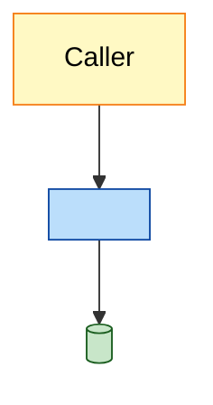

# Markdown Output Template

Section order is fixed. Fill the angle-bracket placeholders. Keep blocks short and bullet-first (see `presentation-and-diagrams.md`). Every sourced claim uses footnote-marker citation + one collapsed sources block per section/subsection (see `citation-and-glossary.md` for the full spec and anchor-naming rule).

```markdown
# <Topic> — Knowledge

> **Verification:** ⚠️ NOT human-verified — AI-generated, pending review. Generated <NAME>, <YYYY-MM-DD>.

> **What this is:** <one-line scope>. **Sourcing:** repo = ground truth (config-as-code); Confluence = narrative, date/trust-scored 🟢 strong · 🟡 partial · 🔴 weak. Confluence links are named + dated. **Today: <YYYY-MM-DD>.**

## Table of Contents
- [1. <Section>](#1-section)
- [2. <Section>](#2-section)
- [… every ## / ### with an anchor …]
- [Contradictions & Open Items](#contradictions--open-items)
- [References](#references)
- [Method note](#method-note)
- [Glossary](#glossary)

## 1. <Section>
- <bullet fact> **<keyword>**.[[1]](#s1-1)
  - <sub-detail>.
- Comparison (when relevant):[[2]](#s1-2)

  | Option | 🟢 Pros | 🔴 Cons |
  |---|---|---|
  | A | … | … |
  | B | … | … |


*Legend: 🟦 service · 🟩 datastore · 🟨 client.*

<details>
<summary>📎 Sources — Section 1</summary>

1. <a id="s1-1"></a>[<Page Name>](https://your-site.atlassian.net/wiki/spaces/SPACE/pages/<id>) (<date>) 🟡
2. <a id="s1-2"></a>[repo] `path/to/file:line` 🟢

</details>

## 2. <Section>
- …[[1]](#s2-1)

<details>
<summary>📎 Sources — Section 2</summary>

1. <a id="s2-1"></a>…

</details>

## Contradictions & Open Items
| # | Topic | Claim A | Claim B | Resolved | Trust |
|---|---|---|---|---|---|
| 1 | … | <page/date> | <repo path> | **Repo wins** — … | 🟢 |
| 2 | … | <page A/date> | <page B/date> | Newest wins / **unresolved — flagged** | 🟡 |

## References
| # | Source | Type | Date | Trust |
|---|---|---|---|---|
| 1 | [<Page Name>](https://your-site.atlassian.net/wiki/spaces/SPACE/pages/<id>) | Confluence | <date> | 🟡 |
| 2 | [repo] `path/to/file` | Repo | n/a | 🟢 |

## Method note
Facts were gathered treating the **<repo>** monorepo as ground truth and Confluence space **<SPACE>** as narrative. Keyword/CQL + repo led discovery; Rovo was used only as a fallback/cross-check. On repo-vs-doc conflict the repo wins (see Contradictions); doc-vs-doc conflicts resolve to the newest page or are flagged. Trust tiers: 🟢 ≥2 pages / fresh / code-confirmed / Feature Guide page · 🟡 minor contradictions or ~2+ yrs stale · 🔴 single unconfirmed / not in code / contradicted.

## Glossary
| Term | Expansion / meaning |
|---|---|
| <ABBR> | <Full name — meaning> |
| <ABBR2> | <…> *(inferred)* 🔴 |
```

## Checklist before saving
- [ ] Banner is line 1 after the H1 and is the switchable form.
- [ ] Glossary is the **last section** (after References/Method note); acronyms also expanded inline on first use.
- [ ] TOC anchors point to real headings.
- [ ] Every sourced claim has a `[[N]](#anchor)` marker resolving into a collapsed sources block (one source per numbered line) at the end of its section/subsection — no bare/unlinked claims.
- [ ] Anchor IDs are unique document-wide (section-prefixed, e.g. `s1-1`, `s4a-2`).
- [ ] Comparisons are tables; pros/cons use 🟢/🔴.
- [ ] Every diagram colored + has a legend; run `verify_mermaid.py --strict`.
- [ ] Contradictions table + consolidated References + Method note present.
