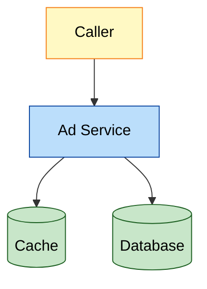

# Mermaid verifier fixture

## Good diagram — vertical, colored, small (should PASS even with --strict)

*Legend: 🟦 service · 🟩 datastore · 🟨 client.*

## Bad diagram — horizontal LR, many nodes, no color (should WARN; fails --strict)

```mermaid
graph LR
  n1[N1] --> n2[N2] --> n3[N3] --> n4[N4] --> n5[N5] --> n6[N6] --> n7[N7]
  n7 --> n8[N8] --> n9[N9] --> n10[N10] --> n11[N11] --> n12[N12] --> n13[N13]
  n13 --> n14[N14] --> n15[N15] --> n16[N16] --> n17[N17] --> n18[N18] --> n19[N19]
  n19 --> n20[N20] --> n21[N21] --> n22[N22] --> n23[N23] --> n24[N24] --> n25[N25]
  n25 --> n26[N26] --> n27[N27]
```

